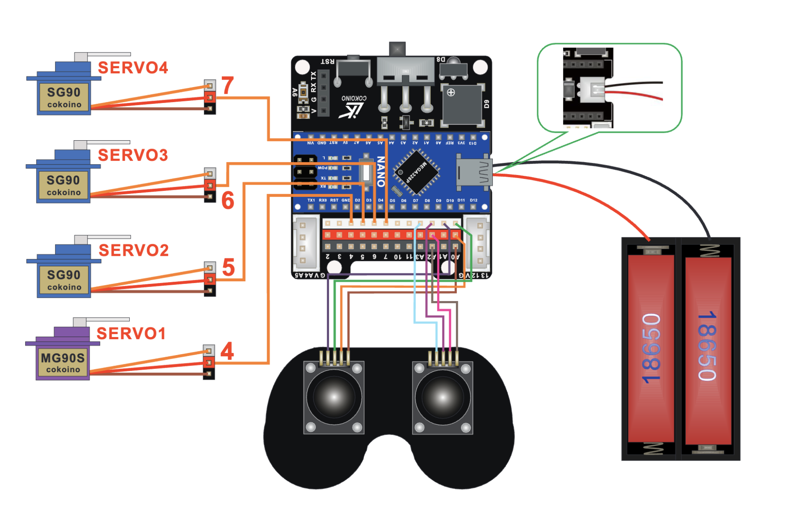
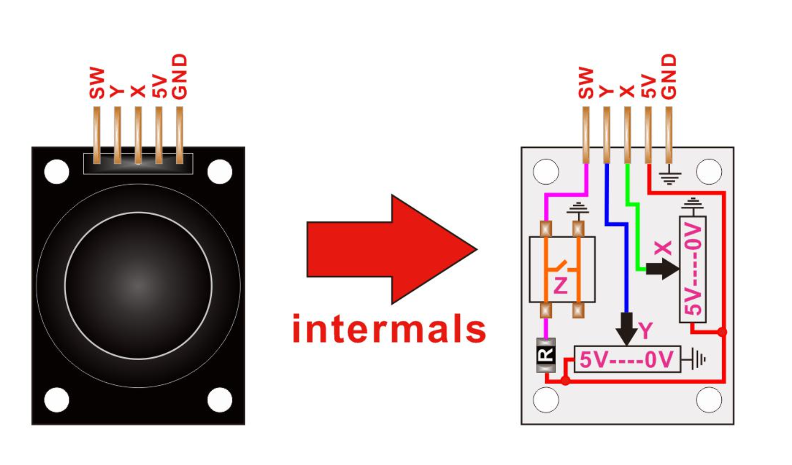
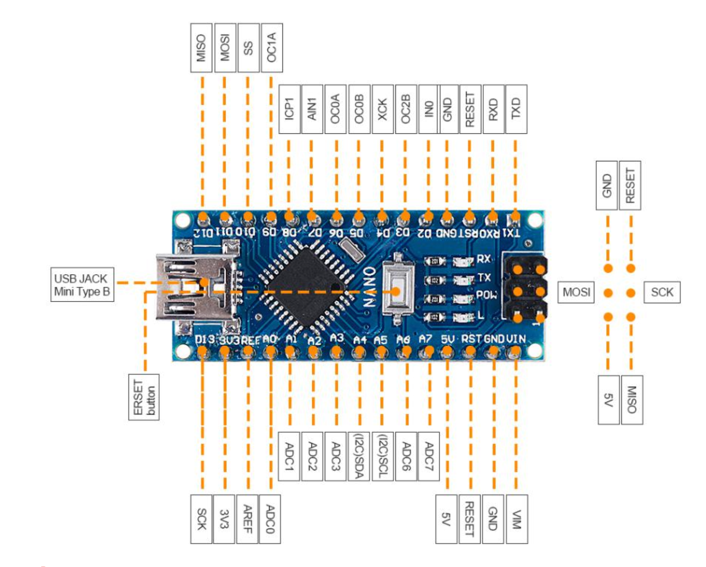
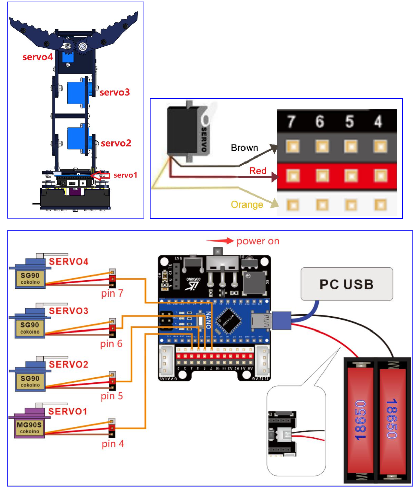
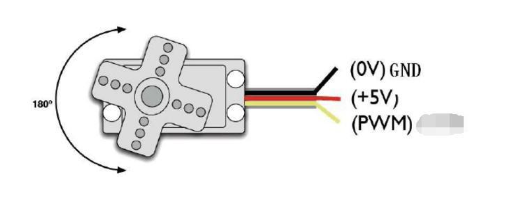
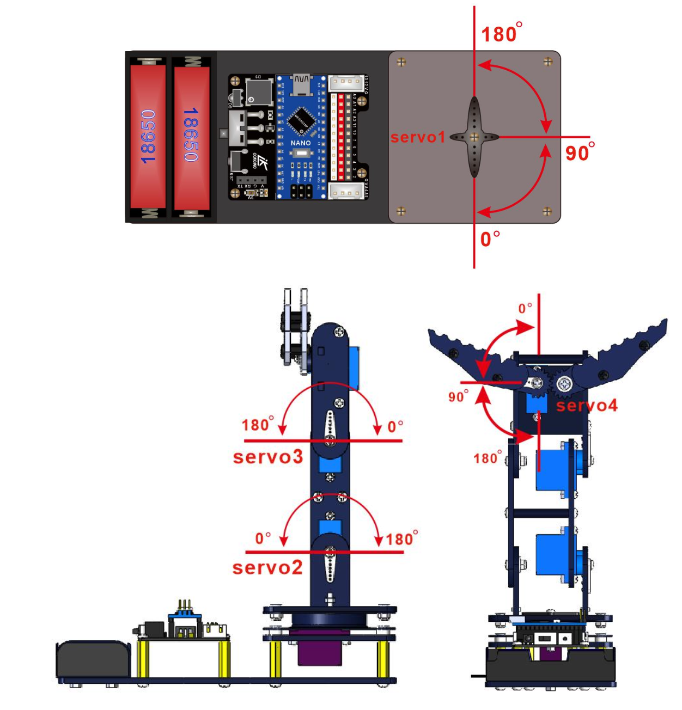
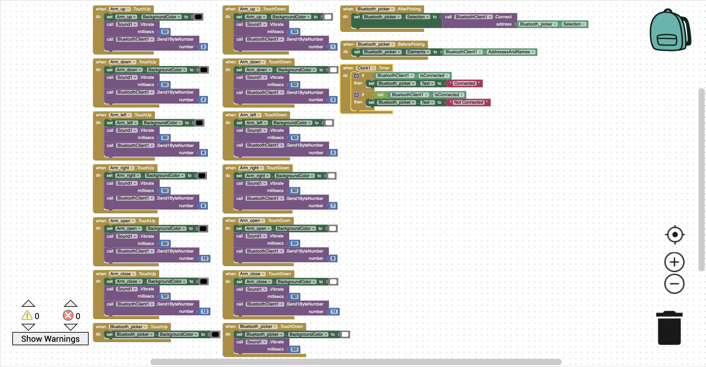

# Phone Controlled Robotic Arm
The phone-controlled robotic arm is a 3-jointed arm with a rotating base. It has 4 rotational degrees of freedom; the bottom which allows the robot to rotate left and right, the 2 joints in the arm that will enable the arm to bend up and down, and the claw which can open and close. It can be controlled using either a wired controller with 2 joysticks, or a mobile app that can control the robot with buttons without the user physically touching the robot. My biggest challenge was coding both my Arduino Nano and my mobile app so that they could communicate with each other via a Bluetooth module. This is because my coding skills weren't solid to begin with and I had never dealt with anything remotely close to Bluetooth in my life. I was also coding in a language I had never coded in before; c++. But I persevered and with the help of some of my Bluestamp counselors, I was able to finish the app and Arduino code and get it all to function within a week. My biggest takeaway was that I could really learn and do so much by jumping into new things that were scary and uncomfortable because eventually, I would figure it out. My biggest triumph was honestly just being able to finish everything and have it all run smoothly without encountering too many errors.


| **Engineer** | **School** | **Area of Interest** | **Grade** |
|:--:|:--:|:--:|:--:|
| Linus F | Aragon High School | Mechanical Engineering | Incoming Freshman

<!---**Replace the BlueStamp logo below with an image of yourself and your completed project. Follow the guide [here](https://tomcam.github.io/least-github-pages/adding-images-github-pages-site.html) if you need help.**


  
# Final Milestone

**Don't forget to replace the text below with the embedding for your milestone video. Go to YouTube, click Share -> Embed, and copy and paste the code to replace what's below.**

<iframe width="560" height="315" src="https://www.youtube.com/watch?v=v7GNhi7AYkI" title="YouTube video player" frameborder="0" allow="accelerometer; autoplay; clipboard-write; encrypted-media; gyroscope; picture-in-picture; web-share" allowfullscreen></iframe>

For your final milestone, explain the outcome of your project. Key details to include are:
- What you've accomplished since your previous milestone
- What your biggest challenges and triumphs were at BSE
- A summary of key topics you learned about
- What you hope to learn in the future after everything you've learned at BSE-->


# Second Milestone

<!---**Don't forget to replace the text below with the embedding for your milestone video. Go to YouTube, click Share -> Embed, and copy and paste the code to replace what's below.**-->

<iframe width="560" height="315" src="https://www.youtube.com/embed/w3uiwzpNiVI?si=iN_QjuzFOkRXbPA1" title="YouTube video player" frameborder="0" allow="accelerometer; autoplay; clipboard-write; encrypted-media; gyroscope; picture-in-picture; web-share" referrerpolicy="strict-origin-when-cross-origin" allowfullscreen></iframe>

## Summary

My second milestone was finishing assembling my 3 jointed robotic arm and making sure that everything worked properly and there were no bugs in my code. I also built the wired controller so that I could control my robot.

## Components Used

- 8 Female-Female Jumper Wires: Connect the controller to the Arduino Shield
- Wooden Cutouts: Creates the bulk of the physical part of the arm and controller
- Screws, nuts, and columns: Holds together all the parts of the robot and controller
- 3 Servo Arms: Connect the cutouts to the servos so they can move together
- 3 MG90s Servos: Rotate to move the arms of the robot
- Zip Ties and Wire Organizing Tubes: Organize all the wires so they don't interfere with the movement of the arm
- 2 Joysticks: Takes physical input from the user so they can control the robot.

## Challenges Faced

The biggest challenge that I faced was when I used the controller the close the claw of the arm, the claw would close but the servo would be able to rotate a little bit more so the other servos in the arm would start rotating to try to compensate for the claw not being able to close. The way that I fixed it was by making an if else statement in the code so that the servo was only allowed to rotate so much so that the claw would close but if it kept on trying to close, it would just stop the operation of that servo and rotate it back a little bit and then resume the operation of the servo.

## Next Steps

I plan on hooking the robot arm up to Bluetooth on a phone so that I can program an app to control the robot remotely on a phone.

# First Milestone

<!---**Don't forget to replace the text below with the embedding for your milestone video. Go to YouTube, click Share -> Embed, and copy and paste the code to replace what's below.**-->

<iframe width="560" height="315" src="https://www.youtube.com/embed/v7GNhi7AYkI?si=HWXX6sRTPQ87sU7z" title="YouTube video player" frameborder="0" allow="accelerometer; autoplay; clipboard-write; encrypted-media; gyroscope; picture-in-picture; web-share" referrerpolicy="strict-origin-when-cross-origin" allowfullscreen></iframe>

<!---For your first milestone, describe what your project is and how you plan to build it. You can include:
- An explanation of the different components of your project and how they will all integrate
- Technical progress you've made so far
- Challenges you're facing and solving in your future milestones
- What your plan is to complete your project-->

## Summary

My first milestone was assembling the base of the robotic arm so that I could test it and make sure that the Arduino Nano, the Arduino Shield, the first servo, and the batteries were all working properly. It was also so I could test uploading the code from the Arduino software to the Arduino Nano to make sure that it was all connected properly

## Components Used

- 1 Arduino Nano: Controls all the servos
- 1 Arduino Shield: Receives power from batteries and hooks up to all the wires
- 1 USB cable: Receives signals and power from the laptop
- 1 Servo: Rotate the base of the arm
- Wooden Cutouts: Creates the bulk of the physical part of the base
- Batteries: Powers everything
- Wires: Connects everything to electricity
- Velcro: Holds the battery holder in place
- Screws, nuts, and columns: Secures all the parts to each other
- Turntable: Uses a ball bearing to allow the base to rotate 360 degrees

## Challenges Faced

The biggest challenge that I faced was when I was assembling the base, I kept screwing in the wrong servo arm into the hole where it is supposed to go. So when I realized my mistake, I would have to take apart half the base just to put in the right servo arm. The screws that kept the servo arm in place were also super tiny so it was really hard getting them in and out. I put the wrong servo arm in twice before I got the right one in.

## Next Steps

I plan on completing the physical part of my robotic arm so that I can control it with a controller using joysticks. To control the servos that will move the arm.

# Schematics 
<!---Here's where you'll put images of your schematics. [Tinkercad](https://www.tinkercad.com/blog/official-guide-to-tinkercad-circuits) and [Fritzing](https://fritzing.org/learning/) are both great resources for creating professional schematic diagrams, though BSE recommends Tinkercad becuase it can be done easily and for free in the browser.-->








# Code
<!---Here's where you'll put your code. The syntax below places it into a block of code. Follow the guide [here]([url](https://www.markdownguide.org/extended-syntax/)) to learn how to customize it to your project needs. -->

## Wired Controller Code
```c++
/*
 * This code applies to the Cokoino mechanical arm
 * Through this link you can download the source code:
 * https://github.com/Cokoino/CKK0006
 * Company website:
 * http://cokoino.com/
 *                                     ________
 *                         ----|servo4| 
 *                        |            --------
 *                    |servo3|   
 *                        |
 *                        |
 *                    |servo2|
 *                        |
 *                        |
 *                  ___________
 *                  |  servo1 |
 *         ____________________
 *         ____________________
 * Functions:
 * arm.servo1.read();   //read the servo of angle
 * arm.servo2.read();
 * arm.servo3.read();
 * arm.servo4.read();
 * 
 * arm.servo1.write(angle);   //servo run
 * arm.servo2.write(angle);
 * arm.servo3.write(angle);
 * arm.servo4.write(angle);
 * 
 * arm.left(speed);    //perform the action 
 * arm.right(speed);
 * arm.up(speed);
 * arm.down(speed);
 * arm.open(speed);
 * arm.close(speed);
 * 
 * arm.captureAction();    //capture the current action,return pointer array
 * arm.do_action(int *p,int speed);  //P is a pointer to the array
 * 
 * arm.JoyStickL.read_x(); //Returns joystick numerical
 * arm.JoyStickL.read_y();
 * arm.JoyStickR.read_x();
 * arm.JoyStickR.read_y();
 */
#include "src/CokoinoArm.h"
#define buzzerPin 9

CokoinoArm arm;
int xL,yL,xR,yR;

const int act_max=10;    //Default 10 action,4 the Angle of servo
int act[act_max][4];    //Only can change the number of action
int num=0,num_do=0;
///////////////////////////////////////////////////////////////
void turnUD(void){
  if(xL!=512){
    if(0<=xL && xL<=100){arm.up(10);return;}
    if(900<xL && xL<=1024){arm.down(10);return;} 
    if(100<xL && xL<=200){arm.up(20);return;}
    if(800<xL && xL<=900){arm.down(20);return;}
    if(200<xL && xL<=300){arm.up(25);return;}
    if(700<xL && xL<=800){arm.down(25);return;}
    if(300<xL && xL<=400){arm.up(30);return;}
    if(600<xL && xL<=700){arm.down(30);return;}
    if(400<xL && xL<=480){arm.up(35);return;}
    if(540<xL && xL<=600){arm.down(35);return;} 
    }
}
///////////////////////////////////////////////////////////////
void turnLR(void){
  if(yL!=512){
    if(0<=yL && yL<=100){arm.right(0);return;}
    if(900<yL && yL<=1024){arm.left(0);return;}  
    if(100<yL && yL<=200){arm.right(5);return;}
    if(800<yL && yL<=900){arm.left(5);return;}
    if(200<yL && yL<=300){arm.right(10);return;}
    if(700<yL && yL<=800){arm.left(10);return;}
    if(300<yL && yL<=400){arm.right(15);return;}
    if(600<yL && yL<=700){arm.left(15);return;}
    if(400<yL && yL<=480){arm.right(20);return;}
    if(540<yL && yL<=600){arm.left(20);return;}
  }
}
///////////////////////////////////////////////////////////////

void turnCO(void){
  if(arm.servo4.read()>7){
    if(0<=xR && xR<=100){arm.close(0);return;}
    if(900<xR && xR<=1024){arm.open(0);return;} 
    if(100<xR && xR<=200){arm.close(5);return;}
    if(800<xR && xR<=900){arm.open(5);return;}
    if(200<xR && xR<=300){arm.close(10);return;}
    if(700<xR && xR<=800){arm.open(10);return;}
    if(300<xR && xR<=400){arm.close(15);return;}
    if(600<xR && xR<=700){arm.open(15);return;}
    if(400<xR && xR<=480){arm.close(20);return;}
    if(540<xR && xR<=600){arm.open(20);return;} 
    }
  else{arm.servo4.write(8);

  }  
}
///////////////////////////////////////////////////////////////
void date_processing(int *x,int *y){
  if(abs(512-*x)>abs(512-*y))
    {*y = 512;}
  else
    {*x = 512;}
}
///////////////////////////////////////////////////////////////
void buzzer(int H,int L){
  while(yR<420){
    digitalWrite(buzzerPin,HIGH);
    delayMicroseconds(H);
    digitalWrite(buzzerPin,LOW);
    delayMicroseconds(L);
    yR = arm.JoyStickR.read_y();
    }
  while(yR>600){
    digitalWrite(buzzerPin,HIGH);
    delayMicroseconds(H);
    digitalWrite(buzzerPin,LOW);
    delayMicroseconds(L);
    yR = arm.JoyStickR.read_y();
    }
}
///////////////////////////////////////////////////////////////
void C_action(void){
  if(yR>800){
    int *p;
    p=arm.captureAction();
    for(char i=0;i<4;i++){
    act[num][i]=*p;
    p=p+1;     
    }
    num++;
    num_do=num;
    if(num>=act_max){
      num=0;
      buzzer(600,400);
      }
    while(yR>600){yR = arm.JoyStickR.read_y();}
    //Serial.println(act[0][0]);
  }
}
///////////////////////////////////////////////////////////////
void Do_action(void){
  if(yR<220){
    buzzer(200,300);
    for(int i=0;i<num_do;i++){
      arm.do_action(act[i],15);
      }
    num=0;
    while(yR<420){yR = arm.JoyStickR.read_y();}
    for(int i=0;i<2000;i++){
      digitalWrite(buzzerPin,HIGH);
      delayMicroseconds(200);
      digitalWrite(buzzerPin,LOW);
      delayMicroseconds(300);        
    }
  }
}
///////////////////////////////////////////////////////////////
void setup() {
  Serial.begin(9600);
  //arm of servo motor connection pins
  arm.ServoAttach(4,5,6,7);
  //arm of joy stick connection pins: xL,yL,xR, yR
  arm.JoyStickAttach(A0,A1,A2,A3);
  pinMode(buzzerPin,OUTPUT);
  arm.servo1.write(90);
  arm.servo2.write(90);
  arm.servo3.write(90);
  arm.servo4.write(90);
}
///////////////////////////////////////////////////////////////
void loop() {
  xL = arm.JoyStickL.read_x();
  yL = arm.JoyStickL.read_y();
  xR = arm.JoyStickR.read_x();
  yR = arm.JoyStickR.read_y();
  date_processing(&xL,&yL);
  date_processing(&xR,&yR);
  turnUD();
  turnLR();
  turnCO();
  C_action();
  Do_action();
  Serial.println(arm.servo4.read());
}
```

I slightly modified the code from LK Cokoino to create my wired controller code.

## Phone and Wired Controller Code

```c++
#include "src/CokoinoArm.h"
#include <SoftwareSerial.h>
#define buzzerPin 9
int state=0;
CokoinoArm arm;
int xL,yL,xR,yR;
SoftwareSerial BTSerial(10,11);
const int act_max=10;    //Default 10 action,4 the Angle of servo
int act[act_max][4];    //Only can change the number of action
int num=0,num_do=0;
void turnUD(void){
  if(xL!=512){
    if(0<=xL && xL<=100){arm.up(10);return;}
    if(900<xL && xL<=1024){arm.down(10);return;} 
    if(100<xL && xL<=200){arm.up(20);return;}
    if(800<xL && xL<=900){arm.down(20);return;}
    if(200<xL && xL<=300){arm.up(25);return;}
    if(700<xL && xL<=800){arm.down(25);return;}
    if(300<xL && xL<=400){arm.up(30);return;}
    if(600<xL && xL<=700){arm.down(30);return;}
    if(400<xL && xL<=480){arm.up(35);return;}
    if(540<xL && xL<=600){arm.down(35);return;} 
    }
}
void turnLR(void){
  if(yL!=512){
    if(0<=yL && yL<=100){arm.right(0);return;}
    if(900<yL && yL<=1024){arm.left(0);return;}  
    if(100<yL && yL<=200){arm.right(5);return;}
    if(800<yL && yL<=900){arm.left(5);return;}
    if(200<yL && yL<=300){arm.right(10);return;}
    if(700<yL && yL<=800){arm.left(10);return;}
    if(300<yL && yL<=400){arm.right(15);return;}
    if(600<yL && yL<=700){arm.left(15);return;}
    if(400<yL && yL<=480){arm.right(20);return;}
    if(540<yL && yL<=600){arm.left(20);return;}
  }
}
void turnCO(void){
  if(arm.servo4.read()>7){
    if(0<=xR && xR<=100){arm.close(0);return;}
    if(900<xR && xR<=1024){arm.open(0);return;} 
    if(100<xR && xR<=200){arm.close(5);return;}
    if(800<xR && xR<=900){arm.open(5);return;}
    if(200<xR && xR<=300){arm.close(10);return;}
    if(700<xR && xR<=800){arm.open(10);return;}
    if(300<xR && xR<=400){arm.close(15);return;}
    if(600<xR && xR<=700){arm.open(15);return;}
    if(400<xR && xR<=480){arm.close(20);return;}
    if(540<xR && xR<=600){arm.open(20);return;} 
    }
  else{arm.servo4.write(8);

  }  
}
void date_processing(int *x,int *y){
  if(abs(512-*x)>abs(512-*y))
    {*y = 512;}
  else
    {*x = 512;}
}
void buzzer(int H,int L){
  while(yR<420){
    digitalWrite(buzzerPin,HIGH);
    delayMicroseconds(H);
    digitalWrite(buzzerPin,LOW);
    delayMicroseconds(L);
    yR = arm.JoyStickR.read_y();
    }
  while(yR>600){
    digitalWrite(buzzerPin,HIGH);
    delayMicroseconds(H);
    digitalWrite(buzzerPin,LOW);
    delayMicroseconds(L);
    yR = arm.JoyStickR.read_y();
    }
}
void C_action(void){
  if(yR>800){
    int *p;
    p=arm.captureAction();
    for(char i=0;i<4;i++){
    act[num][i]=*p;
    p=p+1;     
    }
    num++;
    num_do=num;
    if(num>=act_max){
      num=0;
      buzzer(600,400);
      }
    while(yR>600){yR = arm.JoyStickR.read_y();}
    //Serial.println(act[0][0]);
  }
}
void Do_action(void){
  if(yR<220){
    buzzer(200,300);
    for(int i=0;i<num_do;i++){
      arm.do_action(act[i],15);
      }
    num=0;
    while(yR<420){yR = arm.JoyStickR.read_y();}
    for(int i=0;i<2000;i++){
      digitalWrite(buzzerPin,HIGH);
      delayMicroseconds(200);
      digitalWrite(buzzerPin,LOW);
      delayMicroseconds(300);        
    }
  }
}
void setup() {
  Serial.begin(9600);
  BTSerial.begin(9600);
  //arm of servo motor connection pins
  arm.ServoAttach(4,5,6,7);
  //arm of joy stick connection pins: xL,yL,xR, yR
  arm.JoyStickAttach(A0,A1,A2,A3);
  pinMode(buzzerPin,OUTPUT);
  arm.servo1.write(90);
  arm.servo2.write(90);
  arm.servo3.write(90);
  arm.servo4.write(90);
}

void loop() {
  if(BTSerial.available()>0){
    state=BTSerial.read();
  }
  if(state==1){
    arm.down(20);//moves arm up just says down
  }
  if(state==3){
    arm.up(20);//moves arm down just says up
  }
  if(state==5){
    arm.left(20);
  }
  if(state==7){
    arm.right(20);
  }
  if(state==9){
    arm.open(20);
  }
  if(state==11){
    arm.close(20);
  }
  if(arm.servo4.read()<7){
    arm.servo4.write(8);
  }
  Serial.println(state);
    xL = arm.JoyStickL.read_x();
  yL = arm.JoyStickL.read_y();
  xR = arm.JoyStickR.read_x();
  yR = arm.JoyStickR.read_y();
  date_processing(&xL,&yL);
  date_processing(&xR,&yR);
  turnUD();
  turnLR();
  turnCO();
  C_action();
  Do_action();
}
```

I took my wired controller code and added code for a Bluetooth phone control.

## Block Code



I made this code on my own and it is used for the app that controls the robotic arm via Bluetooth

# Bill of Materials
<!---Here's where you'll list the parts of your project. To add more rows, just copy and paste the example rows below.
Don't forget to place the link of where to buy each component inside the quotation marks in the corresponding row after href =. Follow the guide [here]([url](https://www.markdownguide.org/extended-syntax/)) to learn how to customize this to your project needs. -->

| **Part** | **Note** | **Price** | **Link** |
|:--:|:--:|:--:|:--:|
| Arduino Nano | Controlling all the parts of the arm | $18.93 | <a href="https://www.amazon.com/Arduino-Nano-Every-Single-Board/dp/B07VX7MX27?source=ps-sl-shoppingads-lpcontext&ref_=fplfs&smid=AA57DDZKZUZDL&th=1"> Link </a> |
| Arduino Shield | Extends capability of Arduino Nano | $4.99 | <a href="https://www.microcenter.com/product/632701/Nano_Shield_Board_w-_Power_Switch"> Link </a> |
| Bluetooth Module | Connecting the robot to the app to control it | $15.99 | <a href="https://www.amazon.com/dp/B07VL725T8/ref=as_li_ss_tl?asc_source=01H2RCFWP1ZMCBAR2FTHWM1SF1&ie=UTF8&language=en_US&linkCode=sl1&linkId=fdd96b8c1cdce0e711bfd234114b063e&tag=namespacebran507-20"> Link </a> |
| SG90 Servos | Rotating to move the robotic arm | $8.99 | <a href="https://www.amazon.com/Servo-Servos-Helicopter-Airplane-Controls/dp/B0BJQ2QTHG?source=ps-sl-shoppingads-lpcontext&ref_=fplfs&smid=A2QTZX14X1D97I&th=1"> Link </a> |
| MG90 Servo | Rotating the base of the robot | $19.99 | <a href="https://www.amazon.com/FPVDrone-Geared-Helicopter-Airplane-Controls/dp/B07P7P6FL4?source=ps-sl-shoppingads-lpcontext&ref_=fplfs&psc=1&smid=A1EGCWMH51R7JD"> Link </a> |
| Female to Female Jumper Wires | Connecting all the electric parts of the robot so they all get power | $5.49 | <a href="https://www.amazon.com/GenBasic-Piece-Female-Jumper-Wires/dp/B077NH83CJ?source=ps-sl-shoppingads-lpcontext&ref_=fplfs&smid=AAU5UPIIBDRLP&th=1"> Link </a> |
| PS2 Thumb Joystick Controller | Provides the user a way of input to control the robot | $2.00 | <a href="https://www.firgelli.com/products/ps2-thumb-joystick-controller?variant=39587692839110&currency=USD&utm_medium=product_sync&utm_source=google&utm_content=sag_organic&utm_campaign=sag_organic&srsltid=AfmBOoo9MoDs0a-YF9gyCvymNTjAXhv_4wPBSAWTyedzlEFcI2iK6A5u3P4"> Link </a> |
| Turntable | Allows the base of the robot to rotate freely | $9.95 | <a href="https://www.walmart.com/ip/44-lbs-Capacity-3-Swivel-Lazy-Susan-Turntable-Bearing/746423737?wmlspartner=wlpa&selectedSellerId=18079"> Link </a> |
| AA Batteries | Powering the entire robot | $15.48 | <a href="https://www.amazon.com/AmazonBasics-Performance-Alkaline-Batteries-Count/dp/B00MNV8E0C?source=ps-sl-shoppingads-lpcontext&ref_=fplfs&smid=ATVPDKIKX0DER&th=1"> Link </a> |
| Battery Slot Holder | Holding the batteries in place and taking their power | $1.62 | <a href="https://www.amazon.com/Battery-Holder-Storage-Boxes-Black/dp/B07KNT1TH4"> Link </a> |
| Screws and nuts | Holding together the robot | $38.99 | <a href="https://www.amazon.com/Deluxe-Hardware-Assortment-Professional-Washers/dp/B076CVQZWG?source=ps-sl-shoppingads-lpcontext&ref_=fplfs&psc=1&smid=A1C1KOESPL5YO9"> Link </a> |
| Columns | Holding up different parts of the robot | $11.99 | <a href="https://www.amazon.com/GeeekPi-Standoffs-Assortment-Box，Male-Female-Screwdriver/dp/B07PHBTTGV?source=ps-sl-shoppingads-lpcontext&ref_=fplfs&psc=1&smid=AOP0CH6UTUPHT"> Link </a> |
<!---| Item Name | What the item is used for | $Price | <a href="https://www.amazon.com/Arduino-A000066-ARDUINO-UNO-R3/dp/B008GRTSV6/"> Link </a> |
| Item Name | What the item is used for | $Price | <a href="https://www.amazon.com/Arduino-A000066-ARDUINO-UNO-R3/dp/B008GRTSV6/"> Link </a> |

# Other Resources/Examples
One of the best parts about Github is that you can view how other people set up their work. Here are some past BSE portfolios that are awesome examples. You can view how they set up their portfolio, and you can view their index.md files to understand how they implemented different portfolio components.
- [Example 1](https://trashytuber.github.io/YimingJiaBlueStamp/)
- [Example 2](https://sviatil0.github.io/Sviatoslav_BSE/)
- [Example 3](https://arneshkumar.github.io/arneshbluestamp/)

To watch the BSE tutorial on how to create a portfolio, click here.-->

# Starter Project

<!---**Don't forget to replace the text below with the embedding for your milestone video. Go to YouTube, click Share -> Embed, and copy and paste the code to replace what's below.**-->

<iframe width="560" height="315" src="https://www.youtube.com/embed/syb-JsTi7dA?si=Cn6BqV8syKB3q4L7" title="YouTube video player" frameborder="0" allow="accelerometer; autoplay; clipboard-write; encrypted-media; gyroscope; picture-in-picture; web-share" referrerpolicy="strict-origin-when-cross-origin" allowfullscreen></iframe>

## Summary 

My starter project was the BlueStamp Arduino Starter. There is an Arduino Uno Board and Arduino Shield stacked on top of each other and they are connected to a breadboard with a circuit where a red LED light lights up when you press a button. It is meant to have one input of my choice: a switch, button, pressure sensor, and much more. And one output of my choice could be a motor or a light. The Arduino Uno Board came pre-built and I just had to connect wires to it, but I had to solder all the parts onto my Arduino Shield to build it. 

## Components Used

- 1 Arduino Uno
- 1 USB A->B cable
- 1 Arduino Proto Shield
- 1 Breadboard
- 3 Buttons
- 3 LEDs
- 4 Resistors
- 2 Ceramic Capacitors
- 2 8-pin female 0.1" headers (1*6)
- 5 5-pin female 0.1" headers (1*8)

##  Challenges Faced

The biggest challenge that I faced was trying to build the circuit on the breadboard and Arduino Uno becuase I had never done anything like it before so I didn't fully understand how a breadboard worked and how to make it so that I could put multiple circuits on one breadboard so that they would both work but not interfere with each other. Another challenge was mounting the Arduino Proto Shield onto the Arduino Uno because I had soldered the female pins on but they were a little bit offset so the female and male pins would not fit together. I had to resolder it all so that they would line up.

## Next Steps

I plan to start on my main project, the Phone-Controlled Robotic Arm. I have to build the arm, create a Bluetooth connection between the arm and the phone, and code the arm so that the phone can make the arm work remotely.
